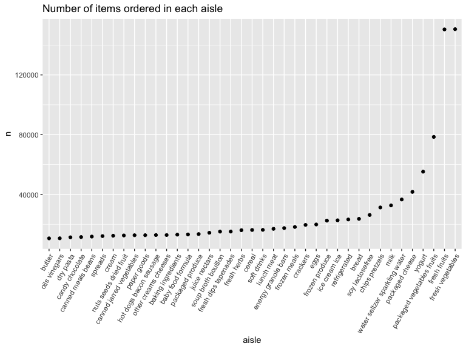

HW3 document
================

``` r
library(tidyverse)
library(p8105.datasets)
```

``` r
knitr::opts_chunk$set(
    echo = TRUE,
    message = FALSE,
    warning = FALSE,
    fig.width = 8, 
  fig.height = 6,
  out.width = "90%"
)
```

\##Problem 1

``` r
library(p8105.datasets)
data("instacart")
```

The `instacart` dataset contains 1384617 observations and
`n nol(instacart)` variables. Each row represent one product from the
instacart order, which contains other information about the product,
product id, name, user id, order number, aisle, department id,
department and the purchase related information such as if the item is
reordered, order hour of the day, day since prior order, and add to cart
order.

``` r
instacart |> 
  group_by(aisle) |> 
  summarize(n_obs = n()) |> 
  arrange (desc(n_obs))
```

    ## # A tibble: 134 × 2
    ##    aisle                          n_obs
    ##    <chr>                          <int>
    ##  1 fresh vegetables              150609
    ##  2 fresh fruits                  150473
    ##  3 packaged vegetables fruits     78493
    ##  4 yogurt                         55240
    ##  5 packaged cheese                41699
    ##  6 water seltzer sparkling water  36617
    ##  7 milk                           32644
    ##  8 chips pretzels                 31269
    ##  9 soy lactosefree                26240
    ## 10 bread                          23635
    ## # ℹ 124 more rows

There are 134 aisles, and `Fresh vegetables` is the most items customers
ordered from.

``` r
instacart |>
  count(aisle) |> 
  filter(n > 10000) |> 
  mutate(aisle = fct_reorder(aisle, n)) |> 
  ggplot(aes(x = aisle, y = n)) + 
  geom_point() + 
  labs(title = "Number of items ordered in each aisle") +
  theme(axis.text.x = element_text(angle = 60, hjust = 1))
```


From this plot, fresh vegetables and fresh fruits are the most ordered
items.

``` r
instacart |> 
  filter(aisle %in% c("baking ingredients", "dog food care", "packaged vegetables fruits")) |>
  group_by(aisle) |> 
  count(product_name) |> 
  mutate(
    rank = min_rank(desc(n))) |> 
  filter(rank <= 3) |> 
  arrange(desc(n)) |>
  knitr::kable()
```

| aisle                      | product_name                                  |    n | rank |
|:---------------------------|:----------------------------------------------|-----:|-----:|
| packaged vegetables fruits | Organic Baby Spinach                          | 9784 |    1 |
| packaged vegetables fruits | Organic Raspberries                           | 5546 |    2 |
| packaged vegetables fruits | Organic Blueberries                           | 4966 |    3 |
| baking ingredients         | Light Brown Sugar                             |  499 |    1 |
| baking ingredients         | Pure Baking Soda                              |  387 |    2 |
| baking ingredients         | Cane Sugar                                    |  336 |    3 |
| dog food care              | Snack Sticks Chicken & Rice Recipe Dog Treats |   30 |    1 |
| dog food care              | Organix Chicken & Brown Rice Recipe           |   28 |    2 |
| dog food care              | Small Dog Biscuits                            |   26 |    3 |

From `packaged vegetables fruits`, the 3 most popular items are organic
baby spinach, organic rasberries, organic blueberries, and from baking
ingredients, light brown sugar, pure baking soda and cane sugar are the
3 most popular items. For dog food care, snack sticks chicken & rice
recipe dog treats, organix chicken & brown rice recipe and small dog
biscuits are the top 3.

``` r
instacart |> 
  filter(
    product_name == "Pink Lady Apples"|
    product_name == "Coffee Ice Cream") |> 
  group_by(product_name, order_dow) |> 
  summarize(mean_hour = mean(order_hour_of_day)) |> 
  pivot_wider(
    names_from = product_name,
    values_from = mean_hour) |> 
  knitr::kable(digits = 2)
```

| order_dow | Coffee Ice Cream | Pink Lady Apples |
|----------:|-----------------:|-----------------:|
|         0 |            13.77 |            13.44 |
|         1 |            14.32 |            11.36 |
|         2 |            15.38 |            11.70 |
|         3 |            15.32 |            14.25 |
|         4 |            15.22 |            11.55 |
|         5 |            12.26 |            12.78 |
|         6 |            13.83 |            11.94 |

\##Problem 2

``` r
library(p8105.datasets)
data("brfss_smart2010")
```

This dataset contains 134203 observations.

``` r
brfss_clean<-
  brfss_smart2010|>
  janitor::clean_names()|>
  filter(
    topic=="Overall Health")|>
  filter(
    response==c("Excellent", "Very good", "Good", "Fair", "Poor"))|>
    arrange(factor(response, levels = c("Poor", "Fair", "Good", "Very good", "Excellent")))
```

For this step in data cleaning, I organize responses as a factor taking
levels ordered from “Poor” to “Excellent, and include only response from
Excellent to poor.

``` r
brfss_clean =
  brfss_smart2010 |> 
  as_tibble() |> 
  janitor::clean_names() |> 
  rename(
    state = locationabbr,
    county = locationdesc) 
```

This step rename state and city, make it easier to look at the data.

``` r
brfss_state2002 <- brfss_clean |>
  filter(year == "2002") |>
  group_by(state) |>
  summarise(county = n_distinct(county)) |>
  filter(county >= 7)

brfss_state2002$state
```

    ## [1] "CT" "FL" "MA" "NC" "NJ" "PA"

The above 6 states state, county were observed at 7 or more locations in
2002.

``` r
brfss_state2010 <- brfss_clean |> 
  filter(year == "2010") |> 
  group_by(state) |> 
  summarise(county = n_distinct(county)) |>  
  filter(county >= 7) 

brfss_state2010$state
```

    ##  [1] "CA" "CO" "FL" "MA" "MD" "NC" "NE" "NJ" "NY" "OH" "PA" "SC" "TX" "WA"

The above 14 states state, county were observed at 7 or more locations
in 2010.

``` r
excellent_data <- brfss_clean |>
  filter(response == "Excellent") |>
  select(year, state, data_value) |>
  group_by(year, state) |>
  summarise(avg_data_value = mean(data_value, na.rm = TRUE) ) |>
  drop_na ()
```

``` r
ggplot(excellent_data, 
       aes(x = year, y = avg_data_value, group = state, color = state)) +
  geom_line () +
  geom_point () +
  labs(title = "Average Value of 'Excellent' Responses Over Time by State",
       x = "Year",
       y = "Average Value") +
  theme(legend.position="left")
```


This is a plot where each state’s line depicts how the average
“Excellent” response value changes over the years.

``` r
ny_data_2006 <- brfss_clean |>
  filter(state == "NY", year == "2006") |>
  select(year, data_value, response, county)
```

This step filter the main dataset to get data specific to: `Years` 2006
, NY state, Responses ranging from “Poor” to “Excellent”

``` r
plot_NY_2006 = ny_data_2006 |>
  ggplot (aes(x=response, y= data_value)) +
  geom_boxplot() +
  labs(
    x= "response",
    y= "data value",
    title= "Plot of Data Value over Responses in 2006 among NY"
  ) +
  scale_fill_discrete(name = "county") +
  theme_minimal()
plot_NY_2006
```


